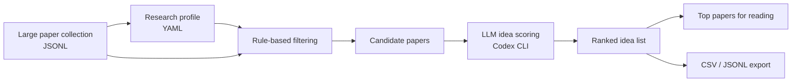

# 🧭 IdeaScout

**Profile-Guided Cross-Domain Research Idea Discovery with LLMs**

<p align="center">
  
  
  
  
</p>

---

## ✨ What is IdeaScout?

**IdeaScout helps researchers discover transferable research ideas from large paper collections.**

Instead of only searching for papers that are already close to your topic, IdeaScout asks a different question:

> **Can the core idea of this paper be transferred to my own research problem?**

You define a **research profile** describing your task, preferred mechanisms, negative filters, and scoring dimensions. IdeaScout then filters papers and uses an LLM to infer each paper’s core idea and score whether it is useful for your research direction.

It is designed for researchers who want to mine ideas from **other fields**, such as computer vision, NLP, multimodal learning, generative modeling, representation learning, robotics, privacy, interpretability, or speech processing.

---

## 🚀 Why use IdeaScout?

Reading thousands of papers manually is impossible. Keyword search is also too limited, because many useful ideas come from papers that do **not** share your task keywords.

IdeaScout is useful when you want to:

* 🔍 Find **cross-domain ideas** for your own research problem.
* 🧠 Discover mechanisms, not just related papers.
* 🧩 Screen papers by **transferability**, **novelty**, and **implementation feasibility**.
* 🗂️ Rank thousands of papers into a manageable reading list.
* ⚙️ Customize the scoring criteria for your own project.
* 🔁 Run long LLM-based scoring jobs with resume and auto-retry.

---

## 🧠 Core idea

IdeaScout separates the process into two stages:

1. **Rule-based candidate filtering**
   Quickly filters a large paper collection using your profile keywords, preferred mechanisms, and negative filters.

2. **LLM-based idea scoring**
   For each candidate paper, an LLM reads the title and abstract, infers the core idea, and scores whether that idea can transfer to your research task.



---

## 🧩 What is a research profile?

A profile is a YAML file that tells IdeaScout what kind of ideas you are looking for.

For example, a researcher working on **medical image segmentation** may want ideas related to:

* uncertainty estimation
* domain adaptation
* foundation model adaptation
* weak supervision
* annotation-efficient learning

A researcher working on **robotics** may want ideas related to:

* policy generalization
* representation grounding
* temporal abstraction
* multimodal planning

A researcher working on **speech privacy** may want ideas related to:

* disentangled representations
* selective attribute obfuscation
* latent editing
* adversarial leakage control

The key point is:

> **IdeaScout does not assume your research field. You define it.**

---

## 📦 Installation

```bash
git clone https://github.com/YOUR_USERNAME/idea-scout.git
cd idea-scout

python -m venv .venv
source .venv/bin/activate

pip install -r requirements.txt
```

If you want to use Codex-based scoring, make sure the Codex CLI is available:

```bash
codex login --device-auth
printf 'Reply only OK\n' | codex exec -
```

Expected output:

```text
OK
```

---

## 📁 Repository structure

```text
idea-scout/
├── README.md
├── LICENSE
├── pyproject.toml
├── requirements.txt
├── configs/
│   ├── profile_template.yaml
│   ├── profile_speechprivacy_accent_example.yaml
│   └── profile_cv_domain_adaptation_example.yaml
├── examples/
│   └── example_input.jsonl
├── scripts/
│   ├── filter_candidates.py
│   ├── score_with_codex.py
│   ├── run_autoretry.py
│   ├── export_rankings.py
│   ├── prepare_portal_ready.py
│   └── check_progress.py
└── idea_scout/
    ├── io_utils.py
    ├── profile.py
    ├── filter_candidates.py
    ├── codex_idea_score.py
    ├── run_autoretry.py
    ├── export_rankings.py
    ├── prepare_portal_ready.py
    └── check_progress.py
```

---

## 📝 Input format

IdeaScout expects a JSONL file where each line is one paper.

Minimum required fields:

```json
{
  "title": "A paper title",
  "abstract": "The paper abstract.",
  "venue": "ICLR",
  "year": 2025,
  "url": "https://example.com/paper"
}
```

Example:

```json
{"title":"Representation Surgery for Concept Editing","abstract":"We propose a method for identifying and editing concept directions in neural representations...","venue":"ICLR","year":2025,"url":"https://example.com"}
{"title":"Temporal Style Transfer for Motion Generation","abstract":"This paper introduces a temporal style factorization method for controllable motion generation...","venue":"CVPR","year":2026,"url":"https://example.com"}
```

---

## ⚙️ Step 1: Create your research profile

Copy the template:

```bash
cp configs/profile_template.yaml configs/my_profile.yaml
```

Edit `configs/my_profile.yaml`.

Example:

```yaml
project_name: My Research Project

description: >
  I want to discover transferable ideas from cross-domain machine learning papers
  that may help my own research problem.

target_tasks:
  - name: Main task
    description: >
      Describe your core research task here.

  - name: Secondary task
    description: >
      Describe another related task, if any.

preferred_mechanisms:
  - latent representation editing
  - modular adapters
  - cross-modal alignment
  - controllable generation
  - concept erasure
  - temporal modeling

positive_keywords:
  - representation editing
  - disentanglement
  - subspace
  - latent direction
  - retrieval augmentation
  - modular network
  - adapter
  - routing
  - concept erasure
  - controllable generation

negative_keywords:
  - survey
  - benchmark only
  - dataset only
  - leaderboard
  - pure application

scoring_dimensions:
  - key: transferability_to_my_task
    name: Transferability to my task
    description: Whether the paper's core idea can be adapted to my research task.
    weight: 2.0

  - key: method_novelty
    name: Method novelty
    description: Whether the paper contains a genuinely interesting method or theory idea.
    weight: 1.2

  - key: implementation_feasibility
    name: Implementation feasibility
    description: Whether the idea looks practical enough to implement or test.
    weight: 1.0

  - key: expected_research_value
    name: Expected research value
    description: Whether the idea could lead to a publishable research direction.
    weight: 1.5
```

---

## 🔎 Step 2: Filter candidate papers

Run rule-based filtering:

```bash
python scripts/filter_candidates.py \
  --input examples/example_input.jsonl \
  --profile configs/my_profile.yaml \
  --output-keep data/candidates.jsonl \
  --output-reject data/rejected.jsonl \
  --output-summary reports/filter_summary.json \
  --target-total 2000 \
  --min-score 1.0
```

This produces:

```text
data/candidates.jsonl
data/rejected.jsonl
reports/filter_summary.json
```

The filtering step is fast and does not call an LLM.

---

## 🤖 Step 3: Score papers with Codex

Before running a large job, test one paper:

```bash
python -u scripts/score_with_codex.py \
  --input data/candidates.jsonl \
  --profile configs/my_profile.yaml \
  --output data/test_scores.jsonl \
  --failures-output data/test_failures.jsonl \
  --top-k 1 \
  --max-new-items 1 \
  --codex-cmd "codex exec"
```

If the test works, run the full scoring job:

```bash
nohup python -u scripts/run_autoretry.py \
  --input data/candidates.jsonl \
  --profile configs/my_profile.yaml \
  --output data/idea_scores.jsonl \
  --failures-output data/idea_score_failures.jsonl \
  --top-k 2000 \
  --codex-cmd "codex exec" \
  --batch-size 1 \
  --sleep-between-rounds 2 \
  --sleep-on-quota 3600 \
  --sleep-on-error 600 \
  --timeout 900 \
  > logs/run_idea_scores_$(date +%F-%H%M%S).out 2>&1 &
```

---

## 📊 Step 4: Check progress

```bash
python scripts/check_progress.py \
  --output data/idea_scores.jsonl \
  --target-total 2000
```

Or monitor continuously:

```bash
watch -n 30 'python scripts/check_progress.py --output data/idea_scores.jsonl --target-total 2000'
```

You can also inspect the latest log:

```bash
tail -f $(ls -t logs/run_idea_scores_*.out | head -1)
```

---

## 🏆 Step 5: Export top-ranked papers

Export the top papers to CSV:

```bash
python scripts/export_rankings.py \
  --input data/idea_scores.jsonl \
  --output data/top100_ideas.csv \
  --top-k 100
```

You can open the CSV in Excel, Numbers, LibreOffice, or any spreadsheet viewer.

---

## 📤 Output format

Each scored paper contains the original metadata plus LLM-generated idea-level fields.

Example output:

```json
{
  "title": "Representation Surgery for Concept Editing",
  "venue": "ICLR",
  "year": 2025,
  "is_suitable": true,
  "priority": "keep",
  "idea_core": "The paper identifies editable concept directions in neural representations.",
  "transferable_mechanism": "Subspace intervention can be reused for controlled representation editing.",
  "fit_reason": "The mechanism aligns with the user's profile and can be adapted to the target task.",
  "risk_or_limitation": "The abstract does not show whether the method preserves all task constraints.",
  "score_overall_fit": 8.0,
  "score_theory_novelty": 7.0,
  "scores": {
    "transferability_to_my_task": 8.0,
    "method_novelty": 7.0,
    "implementation_feasibility": 6.0,
    "expected_research_value": 8.0
  },
  "rank_score": 7.55
}
```

---

## 🧠 How scoring works

For each candidate paper, IdeaScout prompts the LLM to:

1. Read the paper title and abstract.
2. Infer the paper’s **core idea**.
3. Identify the **transferable mechanism**.
4. Judge whether the idea fits the user-defined research profile.
5. Assign scores for each custom scoring dimension.
6. Compute a weighted ranking score.

The LLM is explicitly instructed:

* not to score by keyword overlap only;
* to focus on transferable mechanisms;
* to downweight generic benchmarks, surveys, or dataset-only papers;
* to explain the fit briefly and compactly.

---

## 🧪 Example profiles

IdeaScout includes example profiles for different research directions.

### 🎙️ SpeechPrivacy and accent conversion

```text
configs/profile_speechprivacy_accent_example.yaml
```

This profile looks for ideas related to:

* multi-attribute speech disentanglement
* selective attribute obfuscation
* accent conversion
* representation editing
* leakage control
* privacy-utility evaluation

### 🖼️ Computer vision domain adaptation

```text
configs/profile_cv_domain_adaptation_example.yaml
```

This profile looks for ideas related to:

* domain generalization
* distribution shift
* test-time adaptation
* representation robustness
* pseudo-labeling
* feature alignment

These profiles are examples only. You should create your own profile for your own research task.

---

## 🛠️ Troubleshooting

### Codex says the token was invalidated

If you see:

```text
401 Unauthorized
token_invalidated
refresh_token_invalidated
Your session has ended
Please log in again
```

Run:

```bash
codex logout || true
codex login --device-auth
printf 'Reply only OK\n' | codex exec -
```

Then restart the same scoring command. IdeaScout will resume from the existing output file.

---

### Codex hits usage limits

If you see:

```text
usage limit
rate limit
quota
too many requests
```

The auto-retry runner will sleep and continue later:

```text
[SLEEP_QUOTA] sleeping 3600s
```

Already processed papers are written to JSONL immediately, so progress is not lost.

---

### The process is running but nothing is printed

Use unbuffered Python:

```bash
python -u scripts/run_autoretry.py ...
```

For background jobs, use:

```bash
nohup python -u scripts/run_autoretry.py ... > logs/run.out 2>&1 &
```

---

### Check whether the job is still running

```bash
ps -ef | grep -E 'run_autoretry|score_with_codex|codex exec' | grep -v grep
```

---

## 📚 Recommended workflow

For a large paper collection, a practical workflow is:

```text
1. Collect papers from OpenReview, Semantic Scholar, DBLP, or conference websites.
2. Convert them to JSONL with title and abstract.
3. Write a research profile for your own task.
4. Run rule-based filtering to select 1k-5k candidates.
5. Run LLM scoring with auto-retry.
6. Export top 50-200 papers.
7. Manually read only the most promising papers.
8. Use high-scoring ideas to design new methods or experiments.
```

---

## 🧭 Roadmap

Planned features:

* [ ] PDF full-text parsing
* [ ] OpenReview paper collector
* [ ] Semantic Scholar integration
* [ ] Web portal for browsing scored papers
* [ ] Multi-profile comparison
* [ ] Multi-LLM backend support
* [ ] Paper clustering by transferable mechanism
* [ ] BibTeX export
* [ ] Citation graph support

---

## 🤝 Contributing

Contributions are welcome.

Good first contributions include:

* adding new example profiles;
* improving ranking formulas;
* adding paper collectors;
* improving the prompt template;
* adding visualization or web browsing support.

---

## 📄 License

This project is released under the MIT License.

---

---

## 💡 One-sentence summary

**IdeaScout turns large paper collections into personalized, ranked lists of transferable research ideas.**
